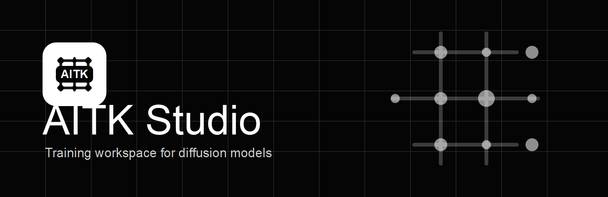
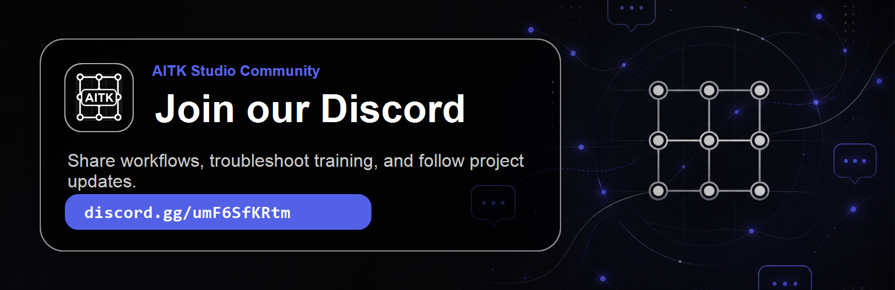
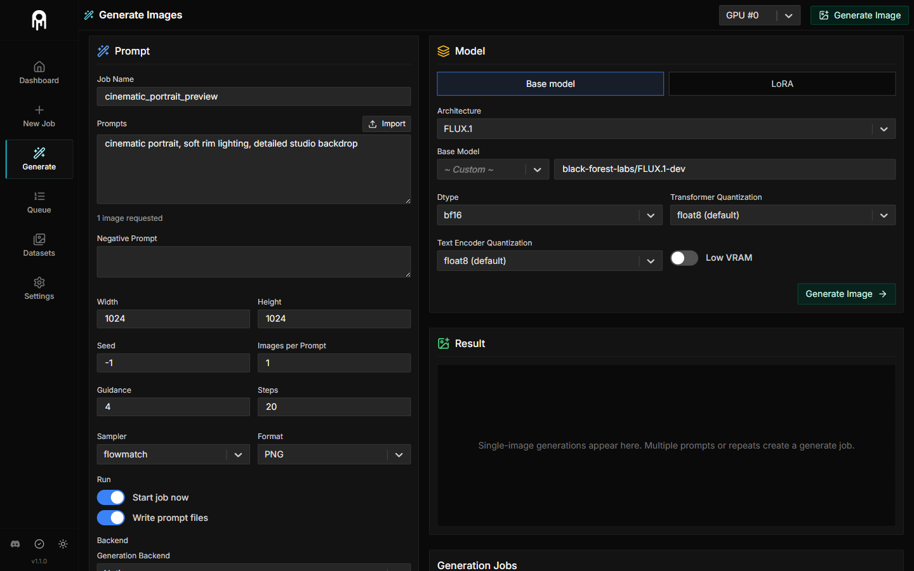
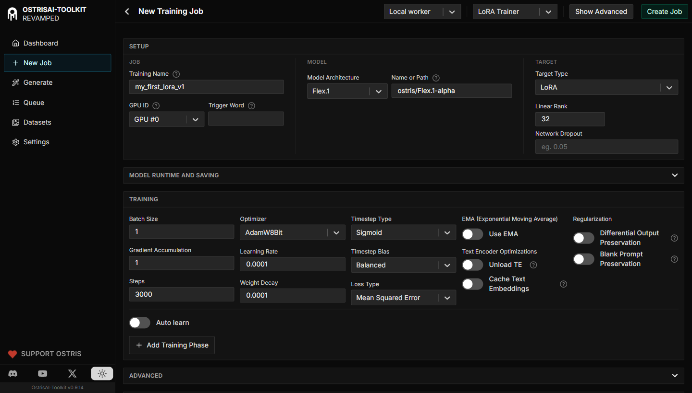
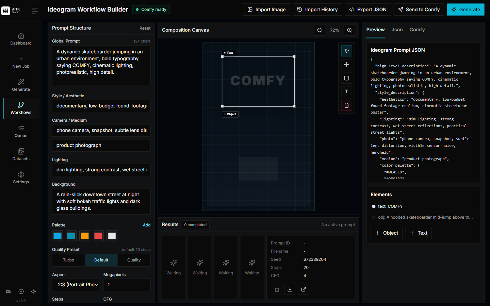
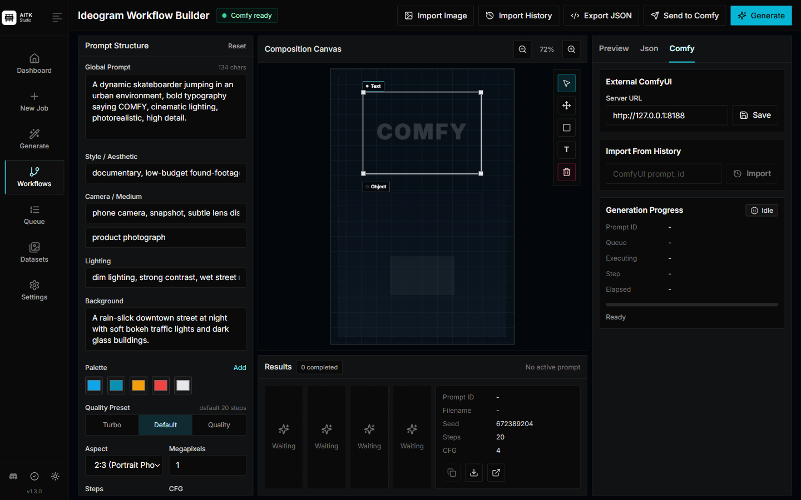

# AITK Studio

<p align="center">

</p>

<p align="center">
  <strong>A training studio for diffusion models, datasets, generation, and queue workflows.</strong>
</p>

<p align="center">
  <a href="https://discord.gg/umF6SfKRtm">
    
  </a>
</p>

AITK Studio is an all-in-one training suite for diffusion models. It supports current image, video, and audio models on consumer-grade hardware, and can be used from either the web UI or the CLI. The goal is a practical workbench: easy enough to get a run started, deep enough for serious LoRA, LoKr, phase-based, encrypted-dataset, and remote-worker workflows.

> **Fork notice:** AITK Studio is a maintained fork of the original [Ostris AI Toolkit](https://github.com/ostris/ai-toolkit). It preserves compatibility with AI Toolkit while adding fast-moving model integrations, UI changes, remote-worker support, and other project-specific changes that may diverge from upstream behavior.

## Highlights

- Web UI for training jobs, datasets, generation, TensorBoard, queue management, and exports.
- Project workspaces keep datasets, runs, outputs, notes, and files isolated under their own project folders.
- CLI-first training still works for config-driven workflows and automation.
- Supports LoRA, LoKr, full fine-tuning paths for selected models, training phases, and auto-learn profiles.
- Includes encrypted dataset workflows with password, key-file, and YubiKey-backed unlock modes.
- Supports local, RunPod, Modal, and remote-worker workflows.
- Free and open source, with original AI Toolkit attribution preserved.

## Contents

- [Supported Models](#supported-models)
- [Quick Start](#quick-start)
- [Web UI](#web-ui)
- [Project Workspaces](#project-workspaces)
- [Developer Utilities](#developer-utilities)
- [Generation](#generation)
- [Monitoring and Storage](#monitoring-and-storage)
- [Remote Workflows](#remote-workflows)
- [Job Import and Export](#job-import-and-export)
- [Security](#security)
- [Training](#training)
- [Cloud Training](#cloud-training)
- [Datasets](#datasets)
- [Advanced Training](#advanced-training)
- [Help and Attribution](#help-and-attribution)

## Supported Models

<details>
<summary><strong>Model list and model-specific notes</strong></summary>

### Image
- [black-forest-labs/FLUX.1-dev](https://huggingface.co/black-forest-labs/FLUX.1-dev) (FLUX.1)
- [black-forest-labs/FLUX.2-dev](https://huggingface.co/black-forest-labs/FLUX.2-dev) (FLUX.2)
- [black-forest-labs/FLUX.2-klein-base-4B](https://huggingface.co/black-forest-labs/FLUX.2-klein-base-4B) (FLUX.2-klein-base-4B)
- [black-forest-labs/FLUX.2-klein-base-9B](https://huggingface.co/black-forest-labs/FLUX.2-klein-base-9B) (FLUX.2-klein-base-9B)
- [Lakonik/AsymFLUX.2-klein-9B](https://huggingface.co/Lakonik/AsymFLUX.2-klein-9B) (AsymFLUX.2-klein-9B, experimental)
- [ostris/Flex.1-alpha](https://huggingface.co/ostris/Flex.1-alpha) (Flex.1)
- [ostris/Flex.2-preview](https://huggingface.co/ostris/Flex.2-preview) (Flex.2)
- [lodestones/Chroma1-Base](https://huggingface.co/lodestones/Chroma1-Base) (Chroma)
- [Alpha-VLLM/Lumina-Image-2.0](https://huggingface.co/Alpha-VLLM/Lumina-Image-2.0) (Lumina2)
- [Qwen/Qwen-Image](https://huggingface.co/Qwen/Qwen-Image) (Qwen-Image)
- [Qwen/Qwen-Image-2512](https://huggingface.co/Qwen/Qwen-Image-2512) (Qwen-Image-2512)
- [zai-org/GLM-Image](https://huggingface.co/zai-org/GLM-Image) (GLM-Image)
- [Boogu/Boogu-Image-0.1-Base](https://huggingface.co/Boogu/Boogu-Image-0.1-Base) (Boogu-Image Base)
- [Boogu/Boogu-Image-0.1-Turbo](https://huggingface.co/Boogu/Boogu-Image-0.1-Turbo) (Boogu-Image Turbo, experimental training)
- [zlab-princeton/i1-3B](https://huggingface.co/zlab-princeton/i1-3B) (i1-3B)
- [HiDream-ai/HiDream-I1-Full](https://huggingface.co/HiDream-ai/HiDream-I1-Full) (HiDream)
- [HiDream-ai/HiDream-O1-Image](https://huggingface.co/HiDream-ai/HiDream-O1-Image) (HiDream-O1)
- [ideogram-ai/ideogram-4-nf4](https://huggingface.co/ideogram-ai/ideogram-4-nf4) (Ideogram 4 NF4)
- [ideogram-ai/ideogram-4-fp8](https://huggingface.co/ideogram-ai/ideogram-4-fp8) (Ideogram 4 FP8)
- [Comfy-Org/Ideogram-4](https://huggingface.co/Comfy-Org/Ideogram-4) (Ideogram 4 Comfy NVFP4/FP8 weights)
- [OmniGen2/OmniGen2](https://huggingface.co/OmniGen2/OmniGen2) (OmniGen2)
- [Tongyi-MAI/Z-Image-Turbo](https://huggingface.co/Tongyi-MAI/Z-Image-Turbo) (Z-Image Turbo)
- [Tongyi-MAI/Z-Image](https://huggingface.co/Tongyi-MAI/Z-Image) (Z-Image)
- [RunDiffusion/Juggernaut-Z-Image](https://huggingface.co/RunDiffusion/Juggernaut-Z-Image) (Juggernaut Z)
- [ostris/Z-Image-De-Turbo](https://huggingface.co/ostris/Z-Image-De-Turbo) (Z-Image De-Turbo)
- [stabilityai/stable-diffusion-xl-base-1.0](https://huggingface.co/stabilityai/stable-diffusion-xl-base-1.0) (SDXL)
- [stable-diffusion-v1-5/stable-diffusion-v1-5](https://huggingface.co/stable-diffusion-v1-5/stable-diffusion-v1-5) (SD 1.5)
- [baidu/ERNIE-Image](https://huggingface.co/baidu/ERNIE-Image) (ERNIE-Image)
- [NucleusAI/Nucleus-Image](https://huggingface.co/NucleusAI/Nucleus-Image) (Nucleus-Image)
- [Photoroom/prxpixel-t2i](https://huggingface.co/Photoroom/prxpixel-t2i) (PRX Pixel)

### Instruction / Edit
- [black-forest-labs/FLUX.1-Kontext-dev](https://huggingface.co/black-forest-labs/FLUX.1-Kontext-dev) (FLUX.1-Kontext-dev)
- [Qwen/Qwen-Image-Edit](https://huggingface.co/Qwen/Qwen-Image-Edit) (Qwen-Image-Edit)
- [Qwen/Qwen-Image-Edit-2509](https://huggingface.co/Qwen/Qwen-Image-Edit-2509) (Qwen-Image-Edit-2509)
- [Qwen/Qwen-Image-Edit-2511](https://huggingface.co/Qwen/Qwen-Image-Edit-2511) (Qwen-Image-Edit-2511)
- [Boogu/Boogu-Image-0.1-Edit](https://huggingface.co/Boogu/Boogu-Image-0.1-Edit) (Boogu-Image Edit)
- [HiDream-ai/HiDream-E1-1](https://huggingface.co/HiDream-ai/HiDream-E1-1) (HiDream E1)

### Video
- [Wan-AI/Wan2.1-T2V-1.3B-Diffusers](https://huggingface.co/Wan-AI/Wan2.1-T2V-1.3B-Diffusers) (Wan 2.1 1.3B)
- [Wan-AI/Wan2.1-I2V-14B-480P-Diffusers](https://huggingface.co/Wan-AI/Wan2.1-I2V-14B-480P-Diffusers) (Wan 2.1 I2V 14B-480P)
- [Wan-AI/Wan2.1-I2V-14B-720P-Diffusers](https://huggingface.co/Wan-AI/Wan2.1-I2V-14B-720P-Diffusers) (Wan 2.1 I2V 14B-720P)
- [Wan-AI/Wan2.1-T2V-14B-Diffusers](https://huggingface.co/Wan-AI/Wan2.1-T2V-14B-Diffusers) (Wan 2.1 14B)
- [Wan-AI/Wan2.2-T2V-A14B-Diffusers](https://huggingface.co/Wan-AI/Wan2.2-T2V-A14B-Diffusers) (Wan 2.2 14B)
- [Wan-AI/Wan2.2-I2V-A14B-Diffusers](https://huggingface.co/Wan-AI/Wan2.2-I2V-A14B-Diffusers) (Wan 2.2 I2V 14B)
- [Wan-AI/Wan2.2-TI2V-5B-Diffusers](https://huggingface.co/Wan-AI/Wan2.2-TI2V-5B-Diffusers) (Wan 2.2 TI2V 5B)
- [Lightricks/LTX-2](https://huggingface.co/Lightricks/LTX-2) (LTX-2)
- [Lightricks/LTX-2.3](https://huggingface.co/Lightricks/LTX-2.3) (LTX-2.3)

### Audio
- [ACE-Step/Ace-Step1.5](https://huggingface.co/ACE-Step/Ace-Step1.5) (Ace Step 1.5)
- [ACE-Step/acestep-v15-xl-base](https://huggingface.co/ACE-Step/acestep-v15-xl-base) (Ace Step 1.5 XL)

### Experimental
- [lodestones/Zeta-Chroma](https://huggingface.co/lodestones/Zeta-Chroma) (Zeta Chroma)

</details>

## Quick Start

### Requirements

- Python 3.10 or newer. Python 3.12 is recommended.
- NVIDIA GPU with enough VRAM for the model and workflow you want to run.
- Python virtual environment support.
- Git.
- Node.js 20.19.0 or newer if you plan to use the web UI.

### Linux

```bash
git clone https://github.com/BadAtCaptchas/AITK-Studio.git
cd AITK-Studio
python3 -m venv venv
source venv/bin/activate
# install the older-GPU Torch stack first
pip3 install -r requirements_torch_legacy_cu128.txt
pip3 install -r requirements.txt
```

For devices running **DGX OS** (including DGX Spark), follow [these](dgx_instructions.md) instructions.

### Windows


```bash
git clone https://github.com/BadAtCaptchas/AITK-Studio.git
cd AITK-Studio
python -m venv venv
.\venv\Scripts\activate
pip install -r requirements_torch_legacy_cu128.txt
pip install -r requirements.txt
```

### macOS

Experimental support for Apple silicon Macs is available. It has not been fully tested on high-RAM Mac systems, so please report issues if you hit them. The convenience script at `./run_mac.zsh` installs dependencies locally and starts the UI:

```bash
git clone https://github.com/BadAtCaptchas/AITK-Studio.git
cd AITK-Studio
chmod +x run_mac.zsh
./run_mac.zsh
```

### NVIDIA Blackwell / RTX 50-series GPUs

Blackwell GPUs such as the RTX 50-series require a PyTorch build with CUDA 12.8 or newer and `sm_120` kernels. If an older CUDA wheel is installed, PyTorch may still report that CUDA is available, but model loading or training can fail or run poorly once kernels are used.

Use the Blackwell Torch stack on Windows and standard Linux systems:

```bash
pip install -r requirements_torch_blackwell_cu128.txt
```

DGX OS users should use the CUDA 13.0 stack in `dgx_instructions.md`.

You can verify the active environment with:

```bash
python scripts/check_blackwell_cuda.py
```

AITK Studio also checks this at startup and will fail early with the recommended install command if it detects a Blackwell GPU with an incompatible PyTorch wheel. Non-Blackwell GPUs continue with a warning if the active Torch version is outside the older-GPU known-good stack. Set `AI_TOOLKIT_SKIP_CUDA_COMPAT_CHECK=1` only for a custom PyTorch build that you know includes Blackwell support.

### HiDream-O1 PyTorch note

The HiDream-O1 model card currently warns against PyTorch 2.9.x. For older GPUs such as L40, use `requirements_torch_legacy_cu128.txt` (`torch==2.8.0`, `torchcodec==0.7.0`). For Blackwell, use `requirements_torch_blackwell_cu128.txt` or the DGX CUDA 13.0 stack (`torch==2.10.0`, `torchcodec==0.10.0`). AITK Studio warns at runtime when HiDream-O1 is started on PyTorch 2.9.x.

### Quantized model cache

FLUX.2 quantized transformer loads and FLUX.2 Klein quantized Qwen3 text encoder loads cache supported `optimum.quanto` weights by default. The first quantized load still builds the quantized model, then later runs can reuse the cache instead of quantizing the same component again.

The default cache location is `MODELS_PATH/.aitk_quantized_cache`, which is usually `models/.aitk_quantized_cache` in this repo. The cache is keyed by the source model files, quantization type, dtype, model settings, and package versions so it is rebuilt when the inputs change.

Set `quantize_cache: false` to disable the cache, or set `quantize_cache_dir` to move it:

```yaml
model:
  quantize_cache: true
  quantize_cache_dir: /path/to/cache
```

The cache is used for `optimum.quanto` qtypes such as `qfloat8`. It is skipped for torchao qtypes and for FLUX.2 transformer loads that use an accuracy recovery adapter.

For offline runs, set `HF_HUB_OFFLINE=1` or `TRANSFORMERS_OFFLINE=1`. FLUX.2 Klein Qwen3 quantized cache entries store the text encoder config with the cached weights, so later cache hits do not need to contact Hugging Face. Older cache entries may need one online rebuild if neither the source model config nor the tokenizer is already cached locally.

### Layer offloading

Layer offloading can reduce peak VRAM by keeping part of a supported model in CPU RAM. The default backend is `block`, which offloads deterministic whole transformer/text-encoder blocks and prefetches them back to CUDA as needed. The older per-Linear/Conv offloader remains available as `legacy` for fallback cases.

```yaml
model:
  layer_offloading: true
  layer_offloading_backend: block # block or legacy
  layer_offloading_transformer_percent: 0.7
  layer_offloading_text_encoder_percent: 0.5
```

The percentage values are fractions of whole blocks for the block backend. Lower values are faster; higher values save more VRAM. The UI fills conservative defaults for supported large CUDA models, but manually edited backend and percentage values are preserved.

Block offloading is currently CUDA-first and is intended for LoRA/network training plus standalone generation. For supported architectures, full base-model fine-tuning with `layer_offloading_backend: block` is rejected unless the base transformer/text encoder is frozen; use LoRA training or set `layer_offloading_backend: legacy` instead. `low_vram` is still separate: it unloads broader model components and can be combined with memory-saving workflows, but it is generally slower than block offloading alone.

## Web UI

| Generate | New Training Job |
| --- | --- |
|  |  |

| Ideogram Workflow Builder | ComfyUI History Import |
| --- | --- |
|  |  |

> **Ideogram external ComfyUI tip:** When using the Ideogram Workflow Builder with external ComfyUI, start ComfyUI with `--fast fp16_accumulation` and `--disable-smart-memory`. Ideogram tends to behave better with those options, and some systems can otherwise hit unexpectedly long generation times.

The AITK Studio UI is the main control surface for creating datasets, starting and stopping jobs, monitoring training, running generation, and exporting work. It can also require a bearer token so the UI is safer to run on a remote machine.

### Project Workspaces

Projects are isolated workspaces for keeping related training work together. Open **Projects** in the UI to create or switch projects, then enter a project's Mission Control view. Each project gets its own sandbox under `PROJECTS_FOLDER` (default: `projects/`) with separate `datasets/`, `configs/`, `runs/`, `outputs/`, `models/`, `assets/`, `notes/`, and `cache/` folders.

Inside a project, the left rail switches between project-local areas:

- **Workspace** shows the Inputs, Active Run, and Outputs flow for that project.
- **Datasets** lists only project datasets. Clicking a dataset opens the full dataset editor, including upload, caption editing, rename, delete, bulk caption tools, encrypted dataset support, and export/copy/combine actions scoped to the project.
- **Files** browses the project sandbox, previews supported image/text files, copies paths, downloads files, and supports guarded rename/delete actions.
- **Runs** shows project-scoped jobs and run details.
- **Generate** wraps the normal Generate workflow with the project locked, so generated jobs and outputs land in the project sandbox.
- **Settings** manages project identity and shows sandbox folder health.

Global Dashboard, Jobs, Datasets, and Generate still work as before when no `project_id` is used. Existing global datasets and outputs are not moved automatically; when a global dataset is used inside a project job, AITK Studio copies it into the project sandbox by default so project configs can use local project paths.

### Run the UI

The UI does not need to stay open for jobs to keep running. It is only needed to start, stop, and monitor jobs. The command below installs or updates the UI dependencies, builds the app, and starts it.

```bash
cd ui
npm run build_and_start
```

You can now access the UI at `http://localhost:8675` or `http://<your-ip>:8675` if you are running it on a server.

## Developer Utilities

To test uncommitted local changes in another checkout without pushing a branch first, use the git-status sync helper:

```bash
python scripts/sync_local_changes.py /path/to/other/ai-toolkit
```

Or from the UI npm scripts:

```bash
npm --prefix ui run sync:local -- /path/to/other/ai-toolkit
```

On Windows, this also works with WSL UNC paths:

```powershell
$env:AITK_DEV_SYNC_TARGET='\\wsl.localhost\Ubuntu\home\<user>\ai-toolkit'
npm --prefix ui run sync:local -- --dry-run
npm --prefix ui run sync:local
```

The helper copies files reported by `git status`, including untracked files, and removes target files for local deletions or rename sources. Use `--tracked-only` to skip untracked files, `--no-delete` to leave target deletions alone, and `--no-verify-target` for non-git target directories.

## Generation

The **Generate** page can run image generation from a base model or a locally trained LoRA without creating a training job. A single requested image is generated inline and displayed on the same page by default. If the request would create more than one image, for example multiple prompts or `Images per Prompt` greater than `1`, the UI creates a normal `generate` job instead so it can run through the queue and be tracked from the jobs page.

Prompts can be typed directly, one prompt per line, or imported from a text file:

```txt
photo of a cinematic portrait, detailed lighting
wide shot of a futuristic city at sunrise
```

Prompt JSON files are also supported for per-image settings. The JSON can be an array, or an object with an `images`, `prompts`, or `samples` array. String entries use the page defaults; object entries can override settings for that image:

```json
{
  "images": [
    {
      "prompt": "photo of a cinematic portrait, detailed lighting",
      "width": 1024,
      "height": 1024,
      "seed": 1234,
      "guidance_scale": 4,
      "sample_steps": 20,
      "negative_prompt": "blurry, low quality"
    },
    {
      "prompt": "wide shot of a futuristic city at sunrise",
      "width": 1344,
      "height": 768,
      "sampler": "flowmatch",
      "format": "webp"
    }
  ]
}
```

Common per-image keys include `prompt`, `negative_prompt` or `neg`, `width`, `height`, `seed`, `guidance_scale`, `sample_steps`, `sampler`, `format` or `ext`, and `network_multiplier`.

## Monitoring and Storage

### TensorBoard

TensorBoard is installed with the Python requirements. If `AITK_ENABLE_TENSORBOARD` is not set, the UI tries to auto-enable TensorBoard when the package is available in the active Python environment and silently skips it if the probe or startup fails.

You can force it on or off when starting the UI:

```bash
# Linux/macOS
AITK_ENABLE_TENSORBOARD=1 npm run build_and_start
AITK_ENABLE_TENSORBOARD=0 npm run build_and_start

# Windows PowerShell
$env:AITK_ENABLE_TENSORBOARD="1"; npm run build_and_start
$env:AITK_ENABLE_TENSORBOARD="0"; npm run build_and_start
```

When TensorBoard is enabled, the UI starts it on port `6006`, writes a small `aitk_status` run so TensorBoard has data before the first training job, writes UI-launched training events to `<training folder>/.tensorboard`, and shows a TensorBoard link on the dashboard and train job overview.

TensorBoard is a separate service and is not protected by `AI_TOOLKIT_AUTH`; use localhost binding, a firewall, or proxy auth when exposing it outside a trusted network.

Optional environment variables:

- `AITK_TENSORBOARD_PORT=6006` changes the TensorBoard port.
- `AITK_TENSORBOARD_HOST=0.0.0.0` changes the bind host.
- `AITK_TENSORBOARD_LOG_DIR=/path/to/logs` changes the event log directory.
- `AITK_TENSORBOARD_PUBLIC_URL=http://host:6006` changes the link shown in the UI, useful behind proxies or custom Docker port mappings.
- `AITK_TENSORBOARD_STATUS_RUN=0` removes and stops writing the synthetic `aitk_status` run. Without another run, TensorBoard may show an empty dashboard until training writes events.

For Docker Compose, leave `AITK_ENABLE_TENSORBOARD` unset for auto-detection, or set it explicitly. The Compose file binds the published TensorBoard port to host `127.0.0.1` by default, even though TensorBoard listens on `0.0.0.0` inside the container so Docker port forwarding can reach it:

```bash
AITK_ENABLE_TENSORBOARD=1 docker compose up
AITK_ENABLE_TENSORBOARD=0 docker compose up
```

### UI database

The UI uses SQLite by default and stores its state in `aitk_db.db`. You can switch all UI-backed state to MongoDB at startup:

```bash
AITK_DB_PROVIDER=mongodb \
AITK_MONGODB_URI="mongodb://localhost:27017" \
AITK_MONGODB_DB=ai_toolkit \
npm run build_and_start
```

Supported database environment variables:

- `AITK_DB_PROVIDER=sqlite|mongodb` defaults to `sqlite`.
- `AITK_SQLITE_PATH` defaults to `../aitk_db.db` from the `ui` folder.
- `AITK_MONGODB_URI` is required when `AITK_DB_PROVIDER=mongodb`.
- `AITK_MONGODB_DB` defaults to `ai_toolkit`.

Run `npm run update_db` after changing database settings. SQLite mode prepares Prisma and the SQLite schema. MongoDB mode prepares the MongoDB indexes while still generating the Prisma client for SQLite fallback support.

To migrate existing SQLite UI data into MongoDB, leave `aitk_db.db` and the training output folders in place, set the MongoDB variables, then run:

```bash
cd ui
AITK_MONGODB_URI="mongodb://localhost:27017" npm run migrate_sqlite_to_mongo
```

The migration imports jobs, queues, settings, and existing per-job `loss_log.db` metrics. SQLite files are left untouched so you can switch back to SQLite.

## Remote Workflows

### Remote workers and Cloudflare Tunnel

The UI can control remote AITK Studio worker instances. Each worker runs the same UI/cron app with `AI_TOOLKIT_AUTH` set. Add the worker from **Settings > Remote Workers** using its public URL and bearer token. When you start a job assigned to a remote worker, the central UI creates a `.aitk.zip` job bundle with datasets, uploads it to the worker, starts the worker queue, and then proxies logs, metrics, samples, checkpoints, and exports back through the central UI.

Remote workers are authoritative after upload. The central UI mirrors status, step, speed, config, and error text from the worker. Base model files are not bundled; they must exist on the worker or the import will report warnings.

Encrypted dataset bundles include only ciphertext dataset folders. Starting an encrypted job on a remote worker requires supplying the dataset secret at start time unless durable encrypted resume was enabled for that job. YubiKey-protected encrypted datasets use the same central unlock path: the browser connected to the central UI prompts for the USB security key, unwraps the dataset key, and the central server forwards only the ephemeral dataset key to the HTTPS worker start request. Remote workers do not need a YubiKey, USB access, or a native FIDO helper. Remote encrypted starts require an `https://` worker URL unless `AITK_ALLOW_INSECURE_REMOTE_ENCRYPTED_DATASETS=1` is set explicitly.

Optional managed `cloudflared` support is configured with environment variables on any instance you want to expose through Cloudflare Tunnel:

```bash
AITK_CLOUDFLARED_ENABLED=1
AITK_CLOUDFLARED_PUBLIC_URL=https://your-worker.example.com
AITK_CLOUDFLARED_TOKEN_FILE=/path/to/cloudflared-token
AITK_CLOUDFLARED_TARGET_URL=http://127.0.0.1:8675
AITK_CLOUDFLARED_METRICS_ADDR=127.0.0.1:60123
AITK_CLOUDFLARED_LOG_LEVEL=info
AITK_CLOUDFLARED_AUTO_DOWNLOAD=0
```

`AI_TOOLKIT_AUTH` is required when `AITK_CLOUDFLARED_ENABLED=1`. `AITK_CLOUDFLARED_TOKEN_FILE` is optional: when it is set, the app starts a named tunnel with that token; when it is not set, the app starts a Cloudflare quick tunnel with a random `trycloudflare.com` URL and shows the generated URL in Settings after Cloudflared reports it. `AITK_CLOUDFLARED_PUBLIC_URL` is optional metadata for named tunnels. The app can start, stop, download, and show tunnel status from the Settings page; Docker images include `cloudflared` for this workflow. If the binary is missing and no custom `AITK_CLOUDFLARED_BIN` is set, the Settings page can download the official Cloudflare GitHub release into `bin/cloudflared` (`bin/cloudflared.exe` on Windows). Set `AITK_CLOUDFLARED_AUTO_DOWNLOAD=1` or enable the Settings checkbox to download automatically before starting.

### Secure remote Ollama captioning

The Queue page includes a **Secure Remote Captioning** job view for image datasets. It starts a local UI caption job that streams one image at a time to a selected **Remote Ollama** endpoint. The remote host can be a standalone Ollama server; it does not need to run the AITK Studio UI. Add direct endpoints from **Settings > Remote Ollama** with the Ollama base URL, such as `http://ollama-host:11434`, and an optional bearer token for protected reverse proxies or tunnels.

Direct Remote Ollama sends prompt, optional system prompt, and image bytes to the configured Ollama HTTP API. Use HTTPS or a protected reverse proxy outside a trusted LAN. The dataset is not bundled or stored on the remote host. The optional system prompt is saved per dataset in the central UI and reused when that dataset is selected.

If you prefer the older Toolkit-proxy mode for a full remote AITK Studio worker, run the UI with `AI_TOOLKIT_AUTH` and Cloudflared as above, and keep Ollama bound to localhost:

```bash
AITK_OLLAMA_ENABLED=1
AITK_OLLAMA_HOST=127.0.0.1:11434
AITK_OLLAMA_BASE_URL=http://127.0.0.1:11434
```

Docker and RunPod images include Ollama. When `AITK_OLLAMA_ENABLED=1`, the startup scripts launch `ollama serve` without exposing port `11434`; only the authenticated UI is exposed through Cloudflared. If the selected Ollama model is not installed, the remote endpoint pulls it automatically before captioning.

Threat model limit: direct Remote Ollama endpoints receive plaintext image and prompt payloads in their HTTP API. HTTPS or a protected tunnel protects transport; the older Toolkit-proxy mode also encrypts payloads at the application layer before the worker UI decrypts them for local Ollama. Neither mode protects against a compromised remote machine or Ollama process.

## Job Import and Export

The UI can export and import training jobs from the queue page. Use the action menu on a training job to export either:

- `Export Job State` for the training folder, job metadata, config, optimizer state when present, and checkpoints.
- `Export With Datasets` for the same job state plus local dataset paths referenced by the job config.

Exports are saved as `.aitk.zip` archives and include a manifest, `job.json`, and `job_config.json`. Base model files are not bundled; local model paths are recorded and checked on import so missing references can be reported as warnings.

Large exports run in the background with progress for files and bytes, success and failed status handling, warning alerts, and a cancel button. Before each export, you can choose whether to include only the latest checkpoint or all checkpoint files in the training folder.

Use `Import Training Job` on the queue page to upload a `.aitk` or `.zip` export. Imports rewrite runtime-local paths, copy included datasets into the configured datasets root, pick the target GPU, rename the job if there is a name conflict, and add the job back to the queue in a stopped state so it can be resumed.

Encrypted dataset exports do not decrypt files. Import/export copies encrypted manifests and `objects/*.bin` files as-is. There is no plaintext or decrypt-export mode.

Jobs launched from the UI are detached from the cron worker process, and the worker now waits for in-flight queue work and disconnects cleanly on shutdown signals.

## Security

If you are hosting the UI on a cloud provider or any network that is not secure, set `AI_TOOLKIT_AUTH` before starting the UI.
When this variable is set, API routes require a matching bearer token and unauthenticated calls are rejected with `401 Unauthorized`.
This includes job creation and job queue/start endpoints, which should never be exposed without authentication.

You can set the environment variable `AI_TOOLKIT_AUTH` to a strong secret token when starting the UI:

```bash
# Linux
AI_TOOLKIT_AUTH=super_secure_password npm run build_and_start

# Windows
set AI_TOOLKIT_AUTH=super_secure_password && npm run build_and_start

# Windows PowerShell
$env:AI_TOOLKIT_AUTH="super_secure_password"; npm run build_and_start
```

## Training

1. Copy the example config file located at `config/examples/train_lora_flux_24gb.yaml` (`config/examples/train_lora_flux_schnell_24gb.yaml` for schnell) to the `config` folder and rename it to `whatever_you_want.yml`
2. Edit the file following the comments in the file
3. Run the file like so `python run.py config/whatever_you_want.yml`

For Ideogram 4 starting points, use `config/examples/train_lora_ideogram4_48gb.yaml` for NF4 LoRA, `config/examples/train_lora_ideogram4_fp8_48gb.yaml` for FP8 LoRA, `config/examples/train_lora_ideogram4_nvfp4_48gb.yaml` for Comfy NVFP4 LoRA, or `config/examples/train_full_fine_tune_ideogram4.yaml` for full conditional-transformer fine-tuning. For Comfy NVFP4 Ideogram 4 LoRA, an H200 GPU is suggested; keep the example's `train.batch_size: 1` so the job fits in memory. Ideogram 4 dataset captions work as natural text or JSON objects serialized as text files; JSON is recommended for best prompt fidelity, and training does not call Ideogram magic-prompt, moderation, or any other hosted API.

When training starts, AITK Studio creates the configured training folder and writes checkpoints and samples there. You can stop training with `Ctrl+C`; when you resume, it picks up from the latest checkpoint.

IMPORTANT: If you press `Ctrl+C` while a checkpoint is saving, it will likely corrupt that checkpoint. Wait until saving finishes before stopping the run.

### Multi-step training phases

Training jobs can split one run into sequential phases with different runtime training settings. This is useful when you want to teach broad structure first, stabilize it, then refine details without rebuilding the model or changing the dataset.

Add `train.phases` to a config. Each phase needs a `name` and `steps`. The top-level `train.steps` value must equal the sum of all phase `steps`. The UI phase editor keeps this synchronized automatically.

```yaml
train:
  steps: 3000
  save_on_phase_change: true
  phases:
    - name: anatomy
      steps: 1200
      optimizer: adamw
      lr: 0.00003
      timestep_type: weighted
      content_or_style: content
      loss_type: mse
      optimizer_params:
        weight_decay: 0.0001
      auto_advance:
        type: loss_plateau
        min_steps: 500

    - name: stabilize
      steps: 1000
      optimizer: adamw
      lr: 0.00001
      timestep_type: weighted
      content_or_style: balanced
      loss_type: mse

    - name: detail
      steps: 800
      optimizer: adamw
      lr: 0.000005
      timestep_type: weighted
      content_or_style: style
      loss_type: mse
```

Phase overrides inherit from the top-level `train` block. Supported phase-local overrides include learning rates, optimizer, optimizer params, LR scheduler params, timestep type/bias, loss type, denoising min/max, SNR settings, and prompt/noise multipliers. Model, network, dataset, save, sample, batch size, gradient accumulation, dtype, cache, LoRA rank, and LoKr rank/factor/advanced settings stay top-level only for the whole run.

At each phase boundary the trainer saves by default, rebuilds the optimizer and LR scheduler, clears gradients, and continues. Phase changes only happen after a completed optimizer update, so boundaries defer cleanly during gradient accumulation. Checkpoints store the current phase index/name and phase-local step so resumes return to the correct phase.

Phases can also advance early by logged metric plateau:

```yaml
auto_advance:
  type: loss_plateau
  metric: loss/loss
  mode: min
  min_steps: 500
  window: 100
  patience: 2
  min_delta_pct: 1.0
```

Defaults are `metric: loss/loss`, `mode: min`, `window: 100`, `patience: 2`, `min_steps: max(200, window * 2)`, and `min_delta_pct: 1.0`. Generated sample images are not scored directly; future evaluators can feed numeric metrics into the same logging system. The UI loss graph shows phase boundary markers when phase metrics are present.

### Auto learn / auto training

Auto learn lets a training job keep running until the configured metric stops improving, then move to the next training phase. When the final phase plateaus, the trainer stops the job. This is useful when the correct number of steps is not known up front.

In the UI, open `New Job`, go to `Training Phases`, and enable `Auto learn`. Fixed step inputs are hidden because auto learn does not know the total step count ahead of time. Profiles can be global or scoped to the selected model architecture; legacy profiles without a model scope remain visible for every model, and newly saved custom profiles record the active model architecture.

The profile dropdown includes an `Anatomy LoKr` preset with three open-ended stages:

- Teach: AdamW, `lr: 0.00002`, weighted high-noise timesteps, MSE loss, `weight_decay: 0.0001`, LoKr factor 8.
- Stabilize: AdamW, `lr: 0.00001`, weighted balanced timesteps, MSE loss.
- Fine detail cleanup: AdamW, `lr: 0.000005`, weighted low-noise timesteps, MSE loss.

For GLM-Image, the UI defaults Auto learn to `glm-image-balanced-lora` instead of the generic Anatomy profile. The GLM profiles are open-ended, use loss-plateau auto advance, save on each phase change, and do not set fixed phase step counts:

- `glm-image-balanced-lora`: LoRA rank/alpha `32`, `adamw8bit`, weighted timesteps, MSE loss, and LR phases `0.00005 -> 0.00003 -> 0.000015` for content, balanced, and style stages.
- `glm-image-low-vram-lora`: LoRA rank/alpha `16`, dropout `0.05`, `adamw8bit`, weighted timesteps, MSE loss, batch size `1`, gradient accumulation `2`, and LR phases `0.00003 -> 0.00002 -> 0.00001`.

For Ideogram 4 NF4, FP8, and Comfy NVFP4, the UI defaults Auto learn to `ideogram4-balanced-lora`. It uses transformer-only LoRA rank/alpha `32`, cached text embeddings, weighted timesteps, caption-aware phases, and LR phases `0.00004 -> 0.000025 -> 0.00001`.

You can also save the current auto-learn settings as a custom profile from the same editor. Custom profiles are stored in the browser's local storage.

For CLI configs, set `train.auto_train: true` and omit phase `steps`. Each phase must have plateau auto-advance settings, either explicitly or by relying on the defaults:

```yaml
train:
  auto_train: true
  save_on_phase_change: true
  optimizer: adamw
  lr: 0.00002
  timestep_type: weighted
  content_or_style: content
  loss_type: mse
  optimizer_params:
    weight_decay: 0.0001
  phases:
    - name: teach anatomy
      lr: 0.00002
      content_or_style: content
      auto_advance:
        type: loss_plateau
        metric: loss/loss
        mode: min
        window: 100
        patience: 2
        min_delta_pct: 1.0

    - name: stabilize
      lr: 0.00001
      content_or_style: balanced
      auto_advance:
        type: loss_plateau

    - name: fine detail cleanup
      lr: 0.000005
      content_or_style: style
      auto_advance:
        type: loss_plateau
```

Progress displays use the current step without a percentage bar while auto learn is active, because there is no planned final step. Resuming a checkpoint restores the current phase and continues plateau tracking from the saved training state.

For a GLM-Image auto-train starting point, see `config/examples/train_lora_glm_image_auto_24gb.yaml`. For Boogu-Image LoRA starts, see `config/examples/train_lora_boogu_image_24gb.yaml`, `config/examples/train_lora_boogu_image_edit_24gb.yaml`, and `config/examples/train_lora_boogu_image_turbo_experimental_24gb.yaml`. For i1-3B LoRA, see `config/examples/train_lora_i1_24gb.yaml`. For Ideogram 4 LoRA and full fine-tune starting points, see `config/examples/train_lora_ideogram4_48gb.yaml`, `config/examples/train_lora_ideogram4_fp8_48gb.yaml`, `config/examples/train_lora_ideogram4_nvfp4_48gb.yaml`, and `config/examples/train_full_fine_tune_ideogram4.yaml`.

### Gradio UI

To train locally with the legacy Gradio UI after installing AITK Studio:

```bash
cd AITK-Studio # in case you are not yet in the AITK-Studio folder
huggingface-cli login # provide a `write` token to publish your LoRA at the end
python flux_train_ui.py
```

This starts a UI for uploading images, captioning them, training a LoRA, and publishing the result.


## Cloud Training

### RunPod

This fork includes a maintained private RunPod Pod template for the AITK Studio UI. See [`runpod/README.md`](runpod/README.md) for the Blackwell-first template, persistent volume layout, required `AI_TOOLKIT_AUTH` secret, and access URL format: `https://<POD_ID>-8675.proxy.runpod.net`.

### Modal

#### 1. Setup

##### AITK Studio

```bash
git clone https://github.com/BadAtCaptchas/AITK-Studio.git
cd AITK-Studio
git submodule update --init --recursive
python -m venv venv
source venv/bin/activate
pip install -r requirements_torch_legacy_cu128.txt
pip install -r requirements.txt
pip install --upgrade accelerate transformers diffusers huggingface_hub # Optional, run it if you run into issues
```

##### Modal
- Run `pip install modal` to install the modal Python package.
- Run `modal setup` to authenticate. If that does not work, try `python -m modal setup`.

##### Hugging Face
- Get a READ token from [here](https://huggingface.co/settings/tokens) and request access to Flux.1-dev model from [here](https://huggingface.co/black-forest-labs/FLUX.1-dev).
- Run `huggingface-cli login` and paste your token.

#### 2. Upload your dataset
- Drag and drop your dataset folder containing the .jpg, .jpeg, .png, .webp, or experimental .jxl images and .txt files in `ai-toolkit`.

#### 3. Configs
- Copy an example config from `config/examples/modal` to the `config` folder and rename it to `whatever_you_want.yml`.
- Edit the config following the comments in the file, **<ins>be careful and follow the example `/root/ai-toolkit` paths</ins>**.

#### 4. Edit run_modal.py
- Set your entire local `ai-toolkit` path at `code_mount = modal.Mount.from_local_dir` like:

   ```
   code_mount = modal.Mount.from_local_dir("/Users/username/ai-toolkit", remote_path="/root/ai-toolkit")
   ```
- Choose a `GPU` and `Timeout` in `@app.function`. The default is A100 40GB with a 2-hour timeout.

#### 5. Training
- Run the config file in your terminal: `modal run run_modal.py --config-file-list-str=/root/ai-toolkit/config/whatever_you_want.yml`.
- You can monitor your training in your local terminal, or on [modal.com](https://modal.com/).
- Models, samples and optimizer will be stored in `Storage > flux-lora-models`.

#### 6. Saving the model
- Check contents of the volume by running `modal volume ls flux-lora-models`.
- Download the content by running `modal volume get flux-lora-models your-model-name`.
- Example: `modal volume get flux-lora-models my_first_flux_lora_v1`.

---

## Datasets

Datasets generally need to be a folder containing images and associated text files. Supported static image formats
are jpg, jpeg, png, webp, and experimental jxl. Animated WebP and animated JPEG XL files are not supported as image dataset inputs; use a video dataset
format or convert them to static WebP, PNG, or JPEG first. WebP transparency is supported for alpha mask and inpaint
workflows, while normal training images are loaded as RGB. The text files should be named the same as the images
but with a `.txt` extension. For example `image2.webp` and `image2.txt`, or `image3.jxl` and `image3.txt`. The text file should contain only the caption.
You can add the word `[trigger]` in the caption file and if you have `trigger_word` in your config, it will be automatically
replaced. 

Images are never upscaled but they are downscaled and placed in buckets for batching. **You do not need to crop/resize your images**.
The loader will automatically resize them and can handle varying aspect ratios. 

### Root auto-caption prompt

For the **Auto Caption** modal, a dataset can include a root-level `ROOT_CAPTION.txt`. When the modal opens for a new caption job, the file contents prefill the `System Prompt` field.

`ROOT_CAPTION.txt` is reserved dataset metadata. Root-level prompt files are hidden from dataset item listings and are not treated as image caption sidecars. Matching is case-insensitive, with exact `ROOT_CAPTION.txt` preferred if duplicates exist. Only the dataset root is used for this prompt; nested files with that name do not set the system prompt.

Encrypted folder imports and uploads also detect root-level `ROOT_CAPTION.txt` before encryption and store its text inside the encrypted catalog metadata. After unlock, encrypted datasets can prefill the main Auto Caption modal the same way. The separate **Secure Remote Captioning** page keeps its existing per-dataset system prompt behavior.

### Encrypted datasets

The UI can create encrypted datasets for images, video, audio, and captions. Choose **Encrypted** when creating a dataset, then select either:

- `Password`: the browser derives an AES-256-GCM key with WebCrypto PBKDF2-SHA256 and a random salt.
- `Key File`: the browser hashes the selected key file and uses the resulting raw key material.
- `YubiKey`: the browser uses WebAuthn PRF with a cross-platform security key, such as a USB YubiKey, to unwrap a randomly generated dataset key.

Encrypted upload happens before files leave the browser. The dataset folder stores:

- `.aitk_encrypted_dataset.json`: clear crypto headers plus an encrypted catalog.
- `objects/<random-id>.bin`: AES-GCM encrypted media and caption payloads.

Original filenames, captions, media metadata, and logical paths live inside the encrypted catalog. The server never receives plaintext media or captions during encrypted upload, preview, caption editing, auto-caption saves, training, import, or export.

To preview, edit, upload more files, auto-caption, or train with an encrypted dataset, open the dataset page and unlock it with the password, key file, or YubiKey. The browser keeps the raw key in page memory only. Training and caption jobs require the secret again when they start; by default, secrets are sent with the start request, are not written into job configs, database rows, logs, or export bundles, and are removed from the Python environment after launch.

YubiKey mode requires a browser and origin that support the WebAuthn PRF extension in a secure context. The dataset key is wrapped to the WebAuthn relying-party ID used when the dataset was created, so unlock from the same hostname you used during creation. The manifest records USB-capable credential metadata and a planned native USB extension point, but direct server-side `libfido2` or `python-fido2` USB access is not implemented yet.

For queue durability, set `AITK_DURABLE_DATASET_KEY_SECRET` to a real secret of at least 32 characters, then enable **Allow durable encrypted resume** when starting an encrypted train or caption job. This stores a wrapped copy of the dataset key in the UI database so the cron launcher can start or resume the queued job after the app restarts. Database backups alone are not enough to recover the dataset key without the server-side wrapping secret, but a compromised server process can still unwrap it. Durable keys are cleared when the job completes successfully or is deleted, and are retained after stop/error states so the job can resume. Changing `AITK_DURABLE_DATASET_KEY_SECRET` invalidates existing queued durable keys and users must re-enter the dataset secret. Durable keys are not written into job configs, launch logs, Python logs, or export bundles.

Threat model limit: encrypted datasets protect against plaintext at rest on disk and accidental dataset export. A compromised training host can still read the key or plaintext from browser, Node, or Python process memory while the dataset is unlocked or training is running. File count and ciphertext sizes are also visible.

Disk caches and plaintext sidecars are disabled for encrypted datasets. Generated controls and external control/mask/inpaint paths are not supported for encrypted datasets yet.


## Advanced Training

### Layer Targeting

To train specific layers with LoRA, you can use the `only_if_contains` network kwargs. For instance, if you want to train only the 2 layers
used by The Last Ben, [mentioned in this post](https://x.com/__TheBen/status/1829554120270987740), you can adjust your
network kwargs like so:

```yaml
      network:
        type: "lora"
        linear: 128
        linear_alpha: 128
        network_kwargs:
          only_if_contains:
            - "transformer.single_transformer_blocks.7.proj_out"
            - "transformer.single_transformer_blocks.20.proj_out"
```

The naming conventions of the layers are in diffusers format, so checking the state dict of a model will reveal 
the suffix of the name of the layers you want to train. You can also use this method to only train specific groups of weights.
For instance to only train the `single_transformer` for FLUX.1, you can use the following:

```yaml
      network:
        type: "lora"
        linear: 128
        linear_alpha: 128
        network_kwargs:
          only_if_contains:
            - "transformer.single_transformer_blocks."
```

You can also exclude layers by their names by using `ignore_if_contains` network kwarg. So to exclude all the single transformer blocks,


```yaml
      network:
        type: "lora"
        linear: 128
        linear_alpha: 128
        network_kwargs:
          ignore_if_contains:
            - "transformer.single_transformer_blocks."
```

`ignore_if_contains` takes priority over `only_if_contains`. So if a weight is covered by both,
if will be ignored.

### LoKr Training

To learn more about LoKr, read more about it at [KohakuBlueleaf/LyCORIS](https://github.com/KohakuBlueleaf/LyCORIS/blob/main/docs/Guidelines.md) and the LyCORIS [network arguments](https://github.com/KohakuBlueleaf/LyCORIS/blob/main/docs/Network-Args.md). To train a LoKr model, change the network type in the config file:

```yaml
      network:
        type: "lokr"
        linear: 16
        linear_alpha: 16
        lokr_factor: 8
        lokr_full_matrix: false
```

`linear` and `linear_alpha` are the LoKr dimension and alpha. `lokr_factor` maps to upstream AI Toolkit `factor`; use `-1` for automatic factorization. Plain LoKr configs default to upstream-compatible factor ordering. Set `lokr_legacy_factorization: false` only when you intentionally want this fork's newer balanced factor layout. `lokr_full_matrix` forces the second Kronecker block to be stored as a full matrix and is normally left off unless you explicitly want that larger model. The older `lokr_full_rank` key is still accepted for compatibility and also enables full-matrix mode.

Current LoKr options can be set either from the UI (`New Job` -> `Target Type: LoKr`) or in YAML:

```yaml
      network:
        type: "lokr"
        linear: 16
        linear_alpha: 16
        lokr_factor: 8
        lokr_use_tucker: true
        lokr_use_scalar: false
        lokr_decompose_both: false
        lokr_weight_decompose: false
        lokr_bypass_mode: false
        lokr_rs_lora: false
```

Supported advanced keys include `lokr_use_tucker`, `lokr_use_scalar`, `lokr_decompose_both`, `lokr_rank_dropout_scale`, `lokr_weight_decompose`, `lokr_wd_on_output`, `lokr_full_matrix`, `lokr_bypass_mode`, `lokr_rs_lora`, `lokr_unbalanced_factorization`, and `lokr_legacy_factorization`. The loader also accepts upstream-style aliases such as `factor`, `use_tucker`, `use_scalar`, `decompose_both`, `rank_dropout_scale`, `weight_decompose`, `dora_wd`, `wd_on_output`, `full_matrix`, `bypass_mode`, `rs_lora`, `unbalanced_factorization`, and `legacy_factorization`.

Everything else should work the same, including layer targeting with `network_kwargs`.

## Help and Attribution

This fork tracks reproducible code bugs in this repository only. If you find a bug in `BadAtCaptchas/AITK-Studio`, open a bug report at [github.com/BadAtCaptchas/AITK-Studio/issues/new?template=bug_report.md](https://github.com/BadAtCaptchas/AITK-Studio/issues/new?template=bug_report.md) and include your reproduction steps, environment details, logs, and the commit or version you are running.

Please do not open bug reports here for upstream-only behavior, setup help, usage questions, or feature requests. If the behavior exists only in the original Ostris AI Toolkit, report it upstream.

AITK Studio is based on the original [Ostris AI Toolkit](https://github.com/ostris/ai-toolkit). Keep the original license and attribution intact when redistributing this project.
