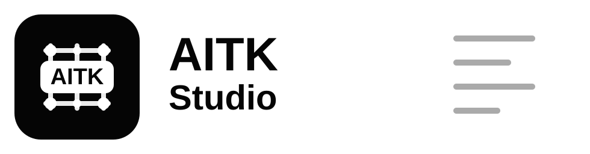
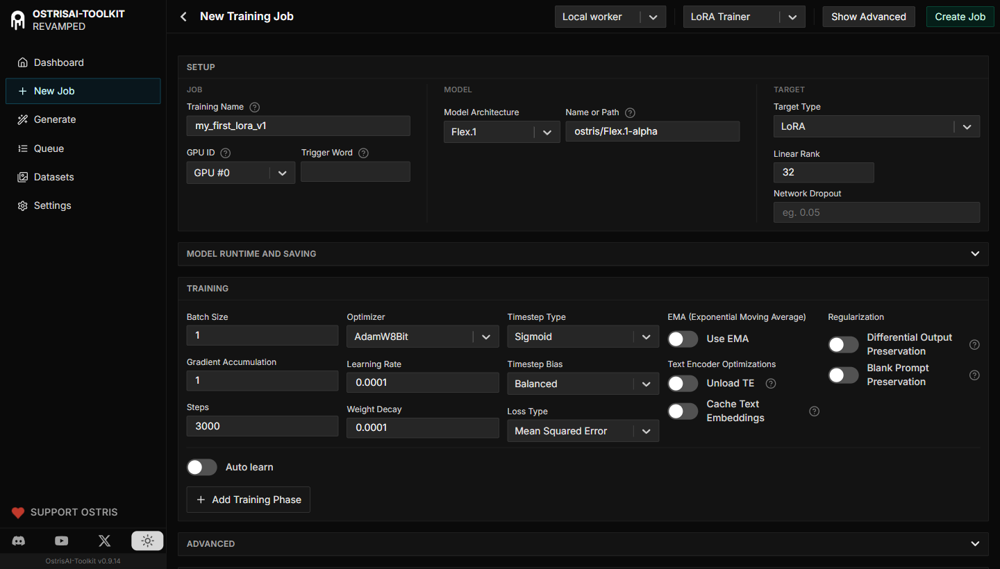
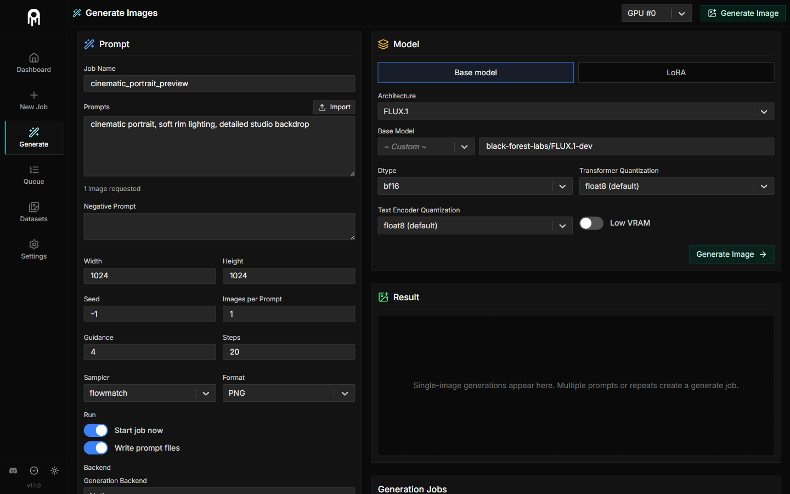

<p align="center">
  <picture>
    <source media="(prefers-color-scheme: dark)" srcset="assets/brand/aitk-studio-logo-inverse.svg">
    
  </picture>
</p>

<h1 align="center">From dataset to trained model.</h1>

<p align="center">
  Train image, video, and audio diffusion models in one studio.<br>
  A guided web UI when you want it. YAML and the CLI when you need them.
</p>

<p align="center">
  <a href="#quick-start"><strong>Get started</strong></a> ·
  <a href="#supported-models">Models</a> ·
  <a href="#documentation">Documentation</a> ·
  <a href="https://github.com/BadAtCaptchas/AITK-Studio/issues/new?template=bug_report.md">Report a bug</a>
</p>

| Set up a training run | Generate with your models |
| :---: | :---: |
| [](assets/readme-ui-new-job.png) | [](assets/readme-ui-generate.png) |

- **Prepare your data.** Organize datasets, edit captions, and use optional dataset encryption.
- **Train your way.** Run LoRA, LoKr, or supported full fine-tunes, locally or on remote workers.
- **Review and create.** Track runs, compare samples, generate images, and export jobs from one library.

AITK Studio is a maintained fork of [Ostris AI Toolkit](https://github.com/ostris/ai-toolkit), with additional model integrations and workflows. Some behavior differs from upstream.

## Quick start

For local NVIDIA setups, you'll need **Python 3.12**, **Git**, and **Node.js 22.12+ (22.x), 24.x, or 26.x** for the web UI. GPU memory requirements depend on the model and training settings.

The default installer uses **CUDA 13.0** and requires a compatible NVIDIA driver. See [installation profiles](docs/installation.md#nvidia-blackwell--rtx-50-series-gpus) if you need CUDA 12.8 compatibility.

Expand your platform to install the runtime and launch the UI:

<details>
<summary><strong>Linux</strong></summary>

```bash
git clone https://github.com/BadAtCaptchas/AITK-Studio.git
cd AITK-Studio
python3.12 -m venv venv
source venv/bin/activate
python scripts/install_runtime.py
cd ui
npm run build_and_start
```

</details>

<details>
<summary><strong>Windows · PowerShell</strong></summary>

```powershell
git clone https://github.com/BadAtCaptchas/AITK-Studio.git
cd AITK-Studio
py -3.12 -m venv venv
.\venv\Scripts\Activate.ps1
python scripts/install_runtime.py
cd ui
npm run build_and_start
```

</details>

Open **[localhost:8675](http://localhost:8675)**. The launch command installs UI dependencies, builds the app, and starts the managed services.

**Other setups:** [Apple silicon (experimental)](docs/installation.md#macos) · [DGX / Spark](dgx_instructions.md) · [Docker](docs/deployment.md#docker-compose) · [RunPod](runpod/README.md) · [Modal](docs/deployment.md#modal)

> Hosting on a server or connecting over your LAN? Follow the [network access and authentication setup](docs/deployment.md#security) before exposing the UI.

### Your first run

1. **Add a dataset** in Datasets and review its captions.
2. **Create a training job**, choose a model and dataset, then review the settings and start it.
3. **Check progress and samples**, then use **Try this model** to load a checkpoint in Generate.

Prefer the terminal? After installing the Python runtime, copy and edit a [model example](config/examples), then run it from the repository root:

```bash
python run.py config/your_training_config.yml
```

See the [training reference](docs/training.md#cli-training) for configuration and resume behavior.

## Supported models

- **Image & editing:** FLUX, Qwen Image / 2.1, Z-Image, SDXL, Ideogram 4, HiDream, Krea 2, and more.
- **Video:** Wan 2.1 / 2.2, LTX-2 / 2.3 / 2.5, and MiniMax H3.
- **Audio:** Ace Step 1.5 and 1.5 XL, plus experimental YuE2; MiniMax H3 also supports joint video/audio workflows.
- **Multimodal text:** Qwen2.5-Omni instruction tuning with image, audio, or video inputs.

**[Browse the full model catalog →](docs/supported-models.md)** for model links and experimental variants. Supported training modes and memory needs vary by model.

## Documentation

| I want to… | Read |
| --- | --- |
| Install or troubleshoot the runtime | [Installation](docs/installation.md) |
| Work with datasets, captions, generation, and job exports | [User guide](docs/user-guide.md) |
| Configure LoKr, training phases, watermarking, or VRAM savings | [Training reference](docs/training.md) |
| Set up remote workers, cloud training, storage, or TensorBoard | [Deployment and operations](docs/deployment.md) |
| Upgrade an installation or recover interrupted work | [Execution and recovery](docs/execution-safety.md) · [Workspace upgrades](docs/deployment.md#upgrading-from-workspace-releases) |
| Develop or test changes to the project | [Development utilities](docs/development.md) |

## Help and credits

[Report a reproducible bug](https://github.com/BadAtCaptchas/AITK-Studio/issues/new?template=bug_report.md) with steps, environment details, logs, and your version or commit. This repository's issue tracker is for bugs in this fork; setup help, usage questions, and feature requests are outside its scope. Report upstream-only bugs to the original project.

Built on [Ostris AI Toolkit](https://github.com/ostris/ai-toolkit). Released under the [MIT license](LICENSE); preserve the original license and attribution when redistributing.
