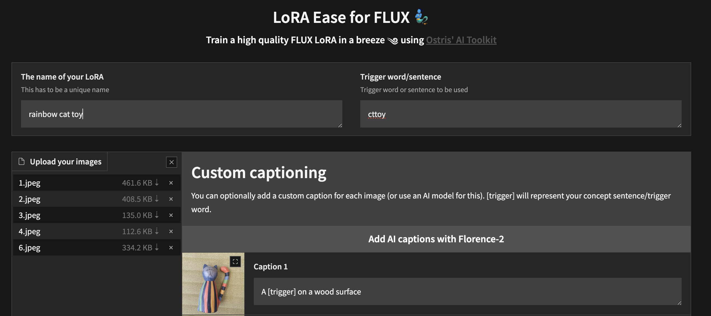

# Training reference

[← Back to AITK Studio](../README.md#documentation)

Use the [example configurations](../config/examples) as starting points. This guide covers CLI runs, adapters, phases, watermarking, and memory controls. Dataset preparation is covered in the [user guide](user-guide.md#datasets).

- [CLI training](#cli-training)
- [LoRA Watermarking](#lora-watermarking)
- [Multi-step training phases](#multi-step-training-phases)
- [Auto learn / auto training](#auto-learn--auto-training)
- [Layer Targeting](#layer-targeting)
- [LoKr Training](#lokr-training)
- [Quantized model cache](#quantized-model-cache)
- [AITK Orbit 4-bit adapter training](#aitk-orbit-4-bit-adapter-training)
- [Layer offloading](#layer-offloading)
- [Gradio UI](#gradio-ui)

## CLI training

1. Copy the example config file located at `config/examples/train_lora_flux_24gb.yaml` (`config/examples/train_lora_flux_schnell_24gb.yaml` for schnell) to the `config` folder and rename it to `whatever_you_want.yml`
2. Edit the file following the comments in the file
3. Run the file like so `python run.py config/whatever_you_want.yml`

For Ideogram 4 starting points, use `config/examples/train_lora_ideogram4_48gb.yaml` for NF4 LoRA, `config/examples/train_lora_ideogram4_fp8_48gb.yaml` for FP8 LoRA, `config/examples/train_lora_ideogram4_nvfp4_48gb.yaml` for Comfy NVFP4 LoRA, or `config/examples/train_full_fine_tune_ideogram4.yaml` for full conditional-transformer fine-tuning. For Comfy NVFP4 Ideogram 4 LoRA, an H200 GPU is suggested; keep the example's `train.batch_size: 1` so the job fits in memory. Ideogram 4 dataset captions work as natural text or JSON objects serialized as text files; JSON is recommended for best prompt fidelity, and training does not call Ideogram magic-prompt, moderation, or any other hosted API.

When training starts, AITK Studio creates the configured training folder and writes checkpoints and samples there. You can stop training with `Ctrl+C`; when you resume, it picks up from the latest checkpoint.

IMPORTANT: If you press `Ctrl+C` while a checkpoint is saving, it will likely corrupt that checkpoint. Wait until saving finishes before stopping the run.

## LoRA Watermarking

AITK Studio includes optional AuthenLoRA-style watermarking for image LoRA training. This is useful when you want a LoRA release to carry an ownership or authenticity signal that can be checked later, while keeping the normal LoRA workflow intact. Watermarking is **off by default** and has no effect unless you enable the `watermark` block in a job config or turn on **Watermarking** in the simple-job UI.

AuthenLoRA trains the LoRA behavior and a secret-bit watermark together. A small mapper converts secret bits into rank-wise LoRA modulation, and the trainer adds an auxiliary watermark loss alongside the normal style/content loss. AITK Studio keeps the standard resumable LoRA checkpoint, then saves extra private/public watermark artifacts when watermarking is enabled.

Supported scope:

- Image LoRA jobs only.
- LoRA, LoCon/LyCORIS, and LoKr networks.
- Standard image LoRA loss path. Guided-loss and mean-flow jobs are currently rejected for watermarking.
- Audio/video adapters and non-image training jobs are not supported.

The UI exposes built-in codec choices for the official AuthenLoRA 48-bit, 80-bit, and 100-bit codecs. CLI configs can use those same packaged local defaults with `builtin:` IDs, or point at an explicit local codec checkpoint. AITK Studio does not download codecs automatically at training startup.

Example config:

```yaml
watermark:
  enabled: true
  method: authenlora
  codec_path: builtin:authenlora_48bits # or a local .pth/.safetensors codec path
  msg_bits: 48
  mapper_rank: 160
  mapper_lr: 0.0001
  watermark_loss_weight: 1.0
  style_loss_weight: 1.0
  zero_message_probability: 0.05
  verify_every: 100
  secret: null # optional binary string matching msg_bits
  bake_on_save: false
```

Available built-in codec IDs:

- `builtin:authenlora_48bits`
- `builtin:authenlora_80bits`
- `builtin:authenlora_100bits`

When enabled, saves include the normal resumable LoRA plus an AuthenLoRA mapper safetensors file and a private local sidecar with the secret, codec fingerprint, thresholds, and verification summary. Public safetensors metadata stores only non-secret watermark metadata such as method, bit count, codec hash, and secret hash. If `bake_on_save` is true, AITK Studio also emits a baked public LoRA with the selected/generated secret applied, which is the most portable export for runtimes that do not understand the dynamic mapper.

## Multi-step training phases

Training jobs can split one run into sequential phases with different runtime training settings. This is useful when you want to teach broad structure first, stabilize it, then refine details without rebuilding the model or changing the dataset.

Add `train.phases` to a config. Each phase needs a `name` and `steps`. The top-level `train.steps` value must equal the sum of all phase `steps`. The UI phase editor keeps this synchronized automatically.

```yaml
train:
  steps: 3000
  save_on_phase_change: true
  phases:
    - name: anatomy
      steps: 1200
      optimizer: adamw
      lr: 0.00003
      timestep_type: weighted
      content_or_style: content
      loss_type: mse
      optimizer_params:
        weight_decay: 0.0001
      auto_advance:
        type: loss_plateau
        min_steps: 500

    - name: stabilize
      steps: 1000
      optimizer: adamw
      lr: 0.00001
      timestep_type: weighted
      content_or_style: balanced
      loss_type: mse

    - name: detail
      steps: 800
      optimizer: adamw
      lr: 0.000005
      timestep_type: weighted
      content_or_style: style
      loss_type: mse
```

Phase overrides inherit from the top-level `train` block. Supported phase-local overrides include learning rates, optimizer, optimizer params, LR scheduler params, timestep type/bias, loss type, denoising min/max, SNR settings, and prompt/noise multipliers. Model, network, dataset, save, sample, batch size, gradient accumulation, dtype, cache, LoRA rank, and LoKr rank/factor/advanced settings stay top-level only for the whole run.

At each phase boundary the trainer saves by default, rebuilds the optimizer and LR scheduler, clears gradients, and continues. Phase changes only happen after a completed optimizer update, so boundaries defer cleanly during gradient accumulation. Checkpoints store the current phase index/name and phase-local step so resumes return to the correct phase.

Phases can also advance early by logged metric plateau:

```yaml
auto_advance:
  type: loss_plateau
  metric: loss/loss
  mode: min
  min_steps: 500
  window: 100
  patience: 2
  min_delta_pct: 1.0
```

Defaults are `metric: loss/loss`, `mode: min`, `window: 100`, `patience: 2`, `min_steps: max(200, window * 2)`, and `min_delta_pct: 1.0`. Generated sample images are not scored directly; future evaluators can feed numeric metrics into the same logging system. The UI loss graph shows phase boundary markers when phase metrics are present.

## Auto learn / auto training

Auto learn lets a training job keep running until the configured metric stops improving, then move to the next training phase. When the final phase plateaus, the trainer stops the job. This is useful when the correct number of steps is not known up front.

In the UI, open `New Job`, go to `Training Phases`, and enable `Auto learn`. Fixed step inputs are hidden because auto learn does not know the total step count ahead of time. Profiles can be global or scoped to the selected model architecture; legacy profiles without a model scope remain visible for every model, and newly saved custom profiles record the active model architecture.

The profile dropdown includes an `Anatomy LoKr` preset with three open-ended stages:

- Teach: AdamW, `lr: 0.00002`, weighted high-noise timesteps, MSE loss, `weight_decay: 0.0001`, LoKr factor 8.
- Stabilize: AdamW, `lr: 0.00001`, weighted balanced timesteps, MSE loss.
- Fine detail cleanup: AdamW, `lr: 0.000005`, weighted low-noise timesteps, MSE loss.

For GLM-Image, the UI defaults Auto learn to `glm-image-balanced-lora` instead of the generic Anatomy profile. The GLM profiles are open-ended, use loss-plateau auto advance, save on each phase change, and do not set fixed phase step counts:

- `glm-image-balanced-lora`: LoRA rank/alpha `32`, `adamw8bit`, weighted timesteps, MSE loss, and LR phases `0.00005 -> 0.00003 -> 0.000015` for content, balanced, and style stages.
- `glm-image-low-vram-lora`: LoRA rank/alpha `16`, dropout `0.05`, `adamw8bit`, weighted timesteps, MSE loss, batch size `1`, gradient accumulation `2`, and LR phases `0.00003 -> 0.00002 -> 0.00001`.

For Ideogram 4 NF4, FP8, and Comfy NVFP4, the UI defaults Auto learn to `ideogram4-balanced-lora`. It uses transformer-only LoRA rank/alpha `32`, cached text embeddings, weighted timesteps, caption-aware phases, and LR phases `0.00004 -> 0.000025 -> 0.00001`.

You can also save the current auto-learn settings as a custom profile from the same editor. Custom profiles are stored in the browser's local storage.

For CLI configs, set `train.auto_train: true` and omit phase `steps`. Each phase must have plateau auto-advance settings, either explicitly or by relying on the defaults:

```yaml
train:
  auto_train: true
  save_on_phase_change: true
  optimizer: adamw
  lr: 0.00002
  timestep_type: weighted
  content_or_style: content
  loss_type: mse
  optimizer_params:
    weight_decay: 0.0001
  phases:
    - name: teach anatomy
      lr: 0.00002
      content_or_style: content
      auto_advance:
        type: loss_plateau
        metric: loss/loss
        mode: min
        window: 100
        patience: 2
        min_delta_pct: 1.0

    - name: stabilize
      lr: 0.00001
      content_or_style: balanced
      auto_advance:
        type: loss_plateau

    - name: fine detail cleanup
      lr: 0.000005
      content_or_style: style
      auto_advance:
        type: loss_plateau
```

Progress displays use the current step without a percentage bar while auto learn is active, because there is no planned final step. Resuming a checkpoint restores the current phase and continues plateau tracking from the saved training state.

For a GLM-Image auto-train starting point, see `config/examples/train_lora_glm_image_auto_24gb.yaml`. For Boogu-Image LoRA starts, see `config/examples/train_lora_boogu_image_24gb.yaml`, `config/examples/train_lora_boogu_image_edit_24gb.yaml`, and `config/examples/train_lora_boogu_image_turbo_experimental_24gb.yaml`. For i1-3B LoRA, see `config/examples/train_lora_i1_24gb.yaml`. For Ideogram 4 LoRA and full fine-tune starting points, see `config/examples/train_lora_ideogram4_48gb.yaml`, `config/examples/train_lora_ideogram4_fp8_48gb.yaml`, `config/examples/train_lora_ideogram4_nvfp4_48gb.yaml`, and `config/examples/train_full_fine_tune_ideogram4.yaml`.

## Layer Targeting

To train specific layers with LoRA, you can use the `only_if_contains` network kwargs. For instance, if you want to train only the 2 layers
used by The Last Ben, [mentioned in this post](https://x.com/__TheBen/status/1829554120270987740), you can adjust your
network kwargs like so:

```yaml
      network:
        type: "lora"
        linear: 128
        linear_alpha: 128
        network_kwargs:
          only_if_contains:
            - "transformer.single_transformer_blocks.7.proj_out"
            - "transformer.single_transformer_blocks.20.proj_out"
```

The naming conventions of the layers are in diffusers format, so checking the state dict of a model will reveal
the suffix of the name of the layers you want to train. You can also use this method to only train specific groups of weights.
For instance to only train the `single_transformer` for FLUX.1, you can use the following:

```yaml
      network:
        type: "lora"
        linear: 128
        linear_alpha: 128
        network_kwargs:
          only_if_contains:
            - "transformer.single_transformer_blocks."
```

You can also exclude layers by their names by using `ignore_if_contains` network kwarg. So to exclude all the single transformer blocks,


```yaml
      network:
        type: "lora"
        linear: 128
        linear_alpha: 128
        network_kwargs:
          ignore_if_contains:
            - "transformer.single_transformer_blocks."
```

`ignore_if_contains` takes priority over `only_if_contains`. So if a weight is covered by both,
it will be ignored.

## LoKr Training

To learn more about LoKr, read more about it at [KohakuBlueleaf/LyCORIS](https://github.com/KohakuBlueleaf/LyCORIS/blob/main/docs/Guidelines.md) and the LyCORIS [network arguments](https://github.com/KohakuBlueleaf/LyCORIS/blob/main/docs/Network-Args.md). To train a LoKr model, change the network type in the config file:

```yaml
      network:
        type: "lokr"
        linear: 16
        linear_alpha: 16
        lokr_factor: 8
        lokr_full_matrix: false
```

`linear` and `linear_alpha` are the LoKr dimension and alpha. `lokr_factor` maps to upstream AI Toolkit `factor`; use `-1` for automatic factorization. Plain LoKr configs default to upstream-compatible factor ordering. Set `lokr_legacy_factorization: false` only when you intentionally want this fork's newer balanced factor layout. `lokr_full_matrix` forces the second Kronecker block to be stored as a full matrix and is normally left off unless you explicitly want that larger model. The older `lokr_full_rank` key is still accepted for compatibility and also enables full-matrix mode.

Current LoKr options can be set either from the UI (`New Job` -> `Target Type: LoKr`) or in YAML:

```yaml
      network:
        type: "lokr"
        linear: 16
        linear_alpha: 16
        lokr_factor: 8
        lokr_use_tucker: true
        lokr_use_scalar: false
        lokr_decompose_both: false
        lokr_weight_decompose: false
        lokr_bypass_mode: false
        lokr_rs_lora: false
```

Supported advanced keys include `lokr_use_tucker`, `lokr_use_scalar`, `lokr_decompose_both`, `lokr_rank_dropout_scale`, `lokr_weight_decompose`, `lokr_wd_on_output`, `lokr_full_matrix`, `lokr_bypass_mode`, `lokr_rs_lora`, `lokr_unbalanced_factorization`, and `lokr_legacy_factorization`. The loader also accepts upstream-style aliases such as `factor`, `use_tucker`, `use_scalar`, `decompose_both`, `rank_dropout_scale`, `weight_decompose`, `dora_wd`, `wd_on_output`, `full_matrix`, `bypass_mode`, `rs_lora`, `unbalanced_factorization`, and `legacy_factorization`.

Everything else should work the same, including layer targeting with `network_kwargs`.

## Quantized model cache

FLUX.2 quantized transformer loads and FLUX.2 Klein quantized Qwen3 text encoder loads cache supported `optimum.quanto` weights and packed Orbit manifests by default. The first quantized load still builds the quantized model, then later runs can reuse the cache instead of quantizing the same component again.

The default cache location is `MODELS_PATH/.aitk_quantized_cache`, which is usually `models/.aitk_quantized_cache` in this repo. The cache is keyed by the source model files, quantization type, dtype, model settings, and package versions so it is rebuilt when the inputs change.

Set `quantize_cache: false` to disable the cache, or set `quantize_cache_dir` to move it:

```yaml
model:
  quantize_cache: true
  quantize_cache_dir: /path/to/cache
```

The cache is used for `optimum.quanto` qtypes such as `qfloat8` and for Orbit qtypes such as `orbit4`. It is skipped for torchao qtypes and for FLUX.2 transformer loads that use an accuracy recovery adapter.

For offline runs, set `HF_HUB_OFFLINE=1` or `TRANSFORMERS_OFFLINE=1`. FLUX.2 Klein Qwen3 quantized cache entries store the text encoder config with the cached weights, so later cache hits do not need to contact Hugging Face. Older cache entries may need one online rebuild if neither the source model config nor the tokenizer is already cached locally.

## AITK Orbit 4-bit adapter training

`orbit4` is AITK Studio's first-party packed-weight backend for LoRA-family
training with a frozen base model. It stores eligible linear weights at roughly
4 bits per parameter, keeps activations and adapter gradients in FP16/BF16, and
propagates gradients through the base without training or retaining a dense base
weight. Full base-model fine-tuning is intentionally rejected.

```yaml
model:
  quantize: true
  qtype: orbit4
  quantize_te: true
  qtype_te: orbit4
  quantize_cache: true
  quantize_kwargs:
    kernel: auto          # auto, triton, or torch
    max_workspace_mb: 64
    include: []
    exclude: []
```

`orbit2`, `orbit3`, and the OrbitVQ formats remain experimental and are hidden from the normal UI selectors.

The `auto` kernel selects the fused Triton path when a compatible installation
is available and otherwise uses the memory-bounded PyTorch path. The fallback is
slower but does not reconstruct a complete dense layer. For 12 GB workflows,
combine Orbit with gradient checkpointing, cached latents and text embeddings,
and the `block` layer-offloading backend. The UI's low-VRAM profile starts with
70% transformer and 50% text-encoder block offload while preserving manual
overrides.

## Layer offloading

Layer offloading can reduce peak VRAM by keeping part of a supported model in CPU RAM. The default backend is `block`, which offloads deterministic whole transformer/text-encoder blocks and prefetches them back to CUDA as needed. The older per-Linear/Conv offloader remains available as `legacy` for fallback cases.

```yaml
model:
  layer_offloading: true
  layer_offloading_backend: block # block or legacy
  layer_offloading_transformer_percent: 0.7
  layer_offloading_text_encoder_percent: 0.5
```

The percentage values are fractions of whole blocks for the block backend. Lower values are faster; higher values save more VRAM. The UI fills conservative defaults for supported large CUDA models, but manually edited backend and percentage values are preserved.

Block offloading is currently CUDA-first and is intended for LoRA/network training plus standalone generation. For supported architectures, full base-model fine-tuning with `layer_offloading_backend: block` is rejected unless the base transformer/text encoder is frozen; use LoRA training or set `layer_offloading_backend: legacy` instead. `low_vram` is still separate: it unloads broader model components and can be combined with memory-saving workflows, but it is generally slower than block offloading alone.

## Gradio UI

To train locally with the legacy Gradio UI after installing AITK Studio:

```bash
cd AITK-Studio # in case you are not yet in the AITK-Studio folder
huggingface-cli login # provide a `write` token to publish your LoRA at the end
python flux_train_ui.py
```

This starts a UI for uploading images, captioning them, training a LoRA, and publishing the result.


