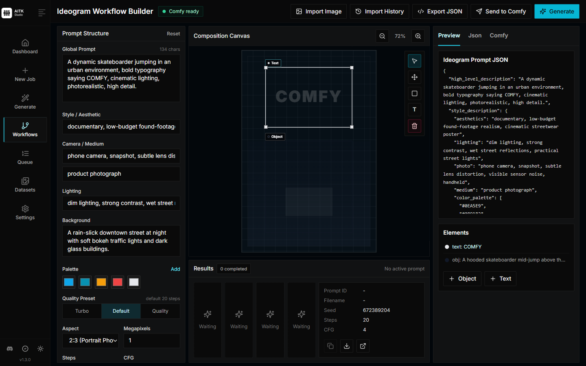
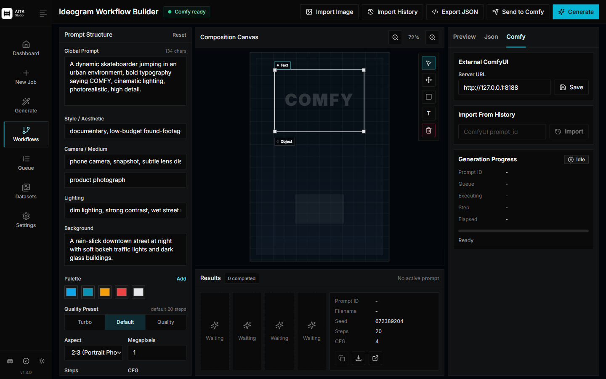

# Using AITK Studio

[← Back to AITK Studio](../README.md#documentation)

Follow the shared library from datasets to training and generation. For setup, see [installation](installation.md); for YAML and specialist settings, see [training](training.md).

- [Training workspace](#training-workspace)
- [Datasets](#datasets)
- [Generation](#generation)
- [Live inference and captioning](#live-inference-and-captioning)
- [Job notes and samples](#job-notes-and-samples)
- [Job Import and Export](#job-import-and-export)
- [Workflow tools and telemetry](#workflow-tools-and-telemetry)

## Training workspace

Use **Home → Datasets → Training → Models → Generate** to prepare data, train, and review the results. Home chooses its next action from loaded run and dataset state. Caption counts describe completeness; they do not establish training quality. Dataset actions can preselect training data, and **Try this model** loads a checkpoint and its model settings in Generate. Workflow and watermark utilities are under **Tools**.

Training starts with guided steps. Expand the labeled options for caching, repeats, augmentation, and specialist settings, or use the raw configuration editor. Unsaved drafts stay in the current browser tab during a dataset-preparation detour; reloading the tab discards them.

Storage uses the configured dataset, training, and model roots in **Settings → Storage**. Global remote workers remain available in **Settings → Compute**.

## Datasets

Datasets generally need to be a folder containing images and associated text files. Supported static image formats
are jpg, jpeg, png, webp, and experimental jxl. Animated WebP and animated JPEG XL files are not supported as image dataset inputs; use a video dataset
format or convert them to static WebP, PNG, or JPEG first. WebP transparency is supported for alpha mask and inpaint
workflows, while normal training images are loaded as RGB. The text files should be named the same as the images
but with a `.txt` extension. For example `image2.webp` and `image2.txt`, or `image3.jxl` and `image3.txt`. The text file should contain only the caption.
You can add the word `[trigger]` in the caption file and if you have `trigger_word` in your config, it will be automatically
replaced.

Images are never upscaled but they are downscaled and placed in buckets for batching. **You do not need to crop/resize your images**.
The loader will automatically resize them and can handle varying aspect ratios.

### Root auto-caption prompt

For the **Auto Caption** modal, a dataset can include a root-level `ROOT_CAPTION.txt`. When the modal opens for a new caption job, the file contents prefill the `System Prompt` field.

`ROOT_CAPTION.txt` is reserved dataset metadata. Root-level prompt files are hidden from dataset item listings and are not treated as image caption sidecars. Matching is case-insensitive, with exact `ROOT_CAPTION.txt` preferred if duplicates exist. Only the dataset root is used for this prompt; nested files with that name do not set the system prompt.

Encrypted folder imports and uploads also detect root-level `ROOT_CAPTION.txt` before encryption and store its text inside the encrypted catalog metadata. After unlock, encrypted datasets can prefill the main Auto Caption modal the same way. The separate **Secure Remote Captioning** page keeps its existing per-dataset system prompt behavior.

### Encrypted datasets

The UI can create encrypted datasets for images, video, audio, and captions. Choose **Encrypted** when creating a dataset, then select either:

- `Password`: the browser derives an AES-256-GCM key with WebCrypto PBKDF2-SHA256 and a random salt.
- `Key File`: the browser hashes the selected key file and uses the resulting raw key material.
- `YubiKey`: the browser uses WebAuthn PRF with a cross-platform security key, such as a USB YubiKey, to unwrap a randomly generated dataset key.

Encrypted upload happens before files leave the browser. The dataset folder stores:

- `.aitk_encrypted_dataset.json`: clear crypto headers plus an encrypted catalog.
- `objects/<random-id>.bin`: AES-GCM encrypted media and caption payloads.

Original filenames, captions, media metadata, and logical paths live inside the encrypted catalog. The server never receives plaintext media or captions during encrypted upload, preview, caption editing, auto-caption saves, training, import, or export.

To preview, edit, upload more files, auto-caption, or train with an encrypted dataset, open the dataset page and unlock it with the password, key file, or YubiKey. The browser keeps the raw key in page memory only. Training and caption jobs require the secret again when they start; by default, secrets are sent with the start request, are not written into job configs, database rows, logs, or export bundles, and are removed from the Python environment after launch.

YubiKey mode requires a browser and origin that support the WebAuthn PRF extension in a secure context. The dataset key is wrapped to the WebAuthn relying-party ID used when the dataset was created, so unlock from the same hostname you used during creation. The manifest records USB-capable credential metadata and a planned native USB extension point, but direct server-side `libfido2` or `python-fido2` USB access is not implemented yet.

For queue durability, set `AITK_DURABLE_DATASET_KEY_SECRET` to a real secret of at least 32 characters, then enable **Allow durable encrypted resume** when starting an encrypted train or caption job. This stores a wrapped copy of the dataset key in the UI database so the cron launcher can start or resume the queued job after the app restarts. Database backups alone are not enough to recover the dataset key without the server-side wrapping secret, but a compromised server process can still unwrap it. Durable keys are cleared when the job completes successfully or is deleted, and are retained after stop/error states so the job can resume. Changing `AITK_DURABLE_DATASET_KEY_SECRET` invalidates existing queued durable keys and users must re-enter the dataset secret. Durable keys are not written into job configs, launch logs, Python logs, or export bundles.

Threat model limit: encrypted datasets protect against plaintext at rest on disk and accidental dataset export. A compromised training host can still read the key or plaintext from browser, Node, or Python process memory while the dataset is unlocked or training is running. File count and ciphertext sizes are also visible.

Disk caches and plaintext sidecars are disabled for encrypted datasets. Generated controls and external control/mask/inpaint paths are not supported for encrypted datasets yet.

## Generation

The **Generate** page can run image generation from a base model or a locally trained LoRA without creating a training job. A single requested image is generated inline and displayed on the same page by default. If the request would create more than one image, for example multiple prompts or `Images per Prompt` greater than `1`, the UI creates a normal `generate` job instead so it can run through the queue and be tracked from the jobs page.

Prompts can be typed directly, one prompt per line, or imported from a text file:

```txt
photo of a cinematic portrait, detailed lighting
wide shot of a futuristic city at sunrise
```

Prompt JSON files are also supported for per-image settings. The JSON can be an array, or an object with an `images`, `prompts`, or `samples` array. String entries use the page defaults; object entries can override settings for that image:

```json
{
  "images": [
    {
      "prompt": "photo of a cinematic portrait, detailed lighting",
      "width": 1024,
      "height": 1024,
      "seed": 1234,
      "guidance_scale": 4,
      "sample_steps": 20,
      "negative_prompt": "blurry, low quality"
    },
    {
      "prompt": "wide shot of a futuristic city at sunrise",
      "width": 1344,
      "height": 768,
      "sampler": "flowmatch",
      "format": "webp"
    }
  ]
}
```

Common per-image keys include `prompt`, `negative_prompt` or `neg`, `width`, `height`, `seed`, `guidance_scale`, `sample_steps`, `sampler`, `format` or `ext`, and `network_multiplier`.

## Live inference and captioning

Open **Generate → Live inference**, select a local GPU, and start an engine. The engine stays in the queue until stopped and keeps model components loaded between requests. Select a model, enter a prompt, optionally upload reference media, and add LoRA or LoKr adapters from the library or uploader. Each adapter has its own strength and enabled toggle. Hook mode permits adapter changes without merging weights; changing merged adapters can reload model components.

Generation shows progress and latent previews where the model provides sampling steps. Use **Reconnect / latest result** after a page reload, **Cancel generation** to cancel a request, **Unload model** to release loaded components, or **Stop engine** to end the job. Outputs can be images, video, audio, or text. Live inference requires the managed Studio app stack and currently supports local engines. Native and ComfyUI generation remain available on the main Generate page.

Caption jobs now include Qwen2.5-Omni and MOSS music captioners, captioner LoRA selection, and ACE-Step formatting/vocal extraction options. Qwen3-Omni accepts audio as well as images and video. YuE2 uses prose and lyric sections; leave tag shuffling and token dropout off to preserve that structure.

## Job notes and samples

Open a job's **Notes** tab to edit its notes. In Samples, Ctrl/Cmd-click toggles selection and Shift-click selects a range; Delete or Backspace opens the deletion confirmation. Audio cards show artwork until opened, and text model samples can be read in the sample viewer.

## Job Import and Export

The UI can export and import training jobs from the queue page. Use the action menu on a training job to export either:

- `Export Job State` for the training folder, job metadata, config, optimizer state when present, and checkpoints.
- `Export With Datasets` for the same job state plus local dataset paths referenced by the job config.

Exports are saved as `.aitk.zip` archives and include a manifest, `job.json`, and `job_config.json`. Base model files are not bundled; local model paths are recorded and checked on import so missing references can be reported as warnings.

Large exports run in the background with progress for files and bytes, success and failed status handling, warning alerts, and a cancel button. Before each export, you can choose whether to include only the latest checkpoint or all checkpoint files in the training folder.

Use `Import Training Job` on the queue page to upload a `.aitk` or `.zip` export. Imports rewrite runtime-local paths, copy included datasets into the configured datasets root, pick the target GPU, rename the job if there is a name conflict, and add the job back to the queue in a stopped state so it can be resumed.

Encrypted dataset exports do not decrypt files. Import/export copies encrypted manifests and `objects/*.bin` files as-is. There is no plaintext or decrypt-export mode.

Jobs launched from the UI are detached from the cron worker process, and the worker now waits for in-flight queue work and disconnects cleanly on shutdown signals.

## Workflow tools and telemetry

| Ideogram Workflow Builder | ComfyUI History Import |
| --- | --- |
|  |  |

> **Ideogram external ComfyUI tip:** When using the Ideogram Workflow Builder with external ComfyUI, start ComfyUI with `--fast fp16_accumulation` and `--disable-smart-memory`. Ideogram tends to behave better with those options, and some systems can otherwise hit unexpectedly long generation times.

The AITK Studio UI is the main control surface for creating datasets, starting and stopping jobs, monitoring training, running generation, and exporting work. It can also require a bearer token so the UI is safer to run on a remote machine.

Hugging Face and Diffusers usage telemetry is disabled by default. Opt in for new UI-launched training, generation, and import processes with **Settings → Library telemetry**. Direct CLI and Modal runs can opt in with `AITK_TELEMETRY_ENABLED=1`.
